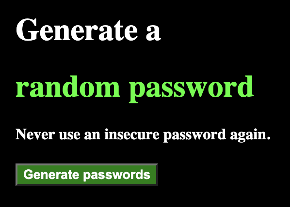

# Password Generator

This project was made for educational purposes but could be applied as a simple component of a game or other software to generate random passwords.

For example, it could be applied to an online banking app to ensure secure connections, such as two step authentifications.

If you've ever been curious about how it's 'made', check out my code to see how it's done!

## This is what the landing page looks like

## Once the user clicks on 'Generate passwords', two passwords will appear underneath which can be copied and pasted by the user.

You can click on the 'Generate passwords' as many times as you'd like to switch random passwords. To return to the landing page, simply refresh the browser!

## Special thanks to: 

Per Herald Borgen at Scrimba